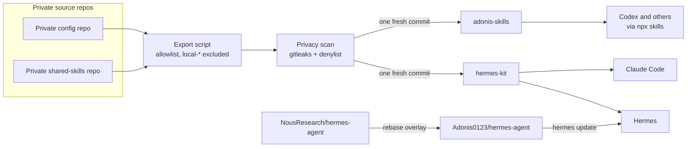

English | [简体中文](README.zh-CN.md)

# hermes-kit

Plugins, skills, and field notes for running [Hermes Agent](https://github.com/NousResearch/hermes-agent) day to day, plus docs for a patched Hermes fork.

<picture>
  <source media="(prefers-color-scheme: dark)" srcset="docs/assets/overview-dark.svg">
  <source media="(prefers-color-scheme: light)" srcset="docs/assets/overview-light.svg">
  
</picture>

## Quick start

| I want to | Run |
| --- | --- |
| Install a Hermes plugin | `hermes plugins install Adonis0123/hermes-kit/plugins/hermes-lock-screen && hermes plugins enable hermes-lock-screen` |
| Register this repo as a Hermes skill source (tap), then `hermes skills install <name>` | `hermes skills tap add Adonis0123/hermes-kit` |
| Install one skill in Hermes | `hermes skills install Adonis0123/hermes-kit/skills/cursor-cli` |
| Use the skills in Claude Code | `/plugin marketplace add Adonis0123/hermes-kit` then `/plugin install hermes-kit@hermes-kit` |
| Use a skill in Codex or other agents | `npx skills add adonis0123/hermes-kit --skill cursor-cli` |
| Run my patched Hermes fork | See [docs/hermes-fork.md](docs/hermes-fork.md) |

More options (pinning, updating, uninstalling): [docs/install.md](docs/install.md).

## Contents

### Plugins

| Plugin | What it does |
| --- | --- |
| [`hermes-lock-screen`](plugins/hermes-lock-screen/) | Owner-only Feishu DM command and tool that locks a macOS screen and verifies the lock. Design: [docs/hermes-lock-screen-design.md](docs/hermes-lock-screen-design.md). |

### Skills

Skills are flat: `skills/<name>/SKILL.md`.

| Skill | What it does |
| --- | --- |
| [`hermes-upstream-check`](skills/hermes-upstream-check/) | Check the Hermes Agent upstream repository for new commits and releases. |
| [`hermes-daily-review`](skills/hermes-daily-review/) | Review the previous day's Hermes sessions before editing skills. |
| [`ai-hotspot-digest`](skills/ai-hotspot-digest/) | Build a daily AI digest (new skills, GitHub projects, news) for a group chat. |
| [`feishu-chat-style-review`](skills/feishu-chat-style-review/) | Review how the agent replies in Feishu groups, using chat history. |
| [`feishu-ui-feedback`](skills/feishu-ui-feedback/) | Turn Feishu messages with UI screenshots into concrete UI fixes. |
| [`desktop-browser-chrome`](skills/desktop-browser-chrome/) | Open URLs in the user's real Chrome instead of a headless browser. |
| [`cursor-cli`](skills/cursor-cli/) | Run the Cursor CLI (`cursor-agent`) from Hermes: print mode, streaming, model choice. |
| [`writing-with-cursor`](skills/writing-with-cursor/) | Draft or polish multi-paragraph prose and docs through Cursor. |
| [`convert-documents-to-markdown`](skills/convert-documents-to-markdown/) | Convert Word, PowerPoint, Excel, and PDF files to Markdown. |

### Docs

| Doc | Topic |
| --- | --- |
| [Install](docs/install.md) | Every install path per host, pinning, updating, uninstalling |
| [Hermes fork](docs/hermes-fork.md) | What the fork is, who should use it, how to switch |
| [Feishu customizations](docs/feishu-customizations.md) | What each fork patch changes for Feishu users |
| [Memory method](docs/memory-method.md) | A write gate for `MEMORY.md`, `USER.md`, and `SOUL.md`, with [templates](docs/templates/) |
| [ADRs](docs/adr/) | Why this repo is exported, and why the fork rebases |
| [Glossary](CONTEXT.md) | Terms used across these docs |

### Guides

Method notes from running Hermes day to day.

| Guide | Topic |
| --- | --- |
| [Memory provider adoption gate](docs/memory-provider-adoption-gate.md) | Hot, warm, and cold memory; when an external memory provider is worth it |
| [Feishu gateway black-box checklist](docs/feishu-gateway-blackbox-checklist.md) | Six manual checks with message-id evidence after a config change or upgrade |
| [Quiet delivery in Feishu groups](docs/feishu-quiet-group-delivery.md) | One message per task on the main timeline, work inside topics, noise off |
| [Remote lock screen design](docs/hermes-lock-screen-design.md) | How `hermes-lock-screen` authorizes, runs, and verifies a Mac lock |
| [Cron digest pipeline pattern](docs/cron-digest-pipeline-pattern.md) | A thin daily-digest pipeline: filter, dedup, single-channel delivery |
| [Upgrade-safe customization](docs/upgrade-safe-customization.md) | What survives `hermes update`, where customizations belong, overlay tests |

Agent-agnostic skills and a list of recommended third-party skills live in [adonis-skills](https://github.com/Adonis0123/adonis-skills).

## How it works

1. Private repos are the single source of truth. Nothing is edited here by hand.
2. An export script copies only allowlisted paths. Files named `local-*` hold personal or company specifics and never leave the private repo.
3. A privacy scan runs before each export, and again in this repo's CI ([`privacy-scan.yml`](.github/workflows/privacy-scan.yml)).
4. Each export lands as one new commit, so no private history is published.
5. The Hermes fork is a separate flow: upstream plus a small overlay, re-applied by rebase on each upstream release.

The reasoning is in [ADR 0001](docs/adr/0001-private-source-allowlist-export.md) and [ADR 0002](docs/adr/0002-fork-overlay-via-rebase.md).

## For AI agents

- [`AGENTS.md`](AGENTS.md): install commands per host, repo layout, naming rules, validation commands.
- [`llms.txt`](llms.txt): a short index of this repo for LLMs.
- `skills/` and `plugins/` are generated. Open an issue or PR here and the change will be made in the source.

## Related

- [adonis-skills](https://github.com/Adonis0123/adonis-skills): agent-agnostic skills and recommended third-party skills.
- [Adonis0123/hermes-agent](https://github.com/Adonis0123/hermes-agent): the patched Hermes fork.
- [NousResearch/hermes-agent](https://github.com/NousResearch/hermes-agent): upstream Hermes Agent.

## License

[MIT](LICENSE)
