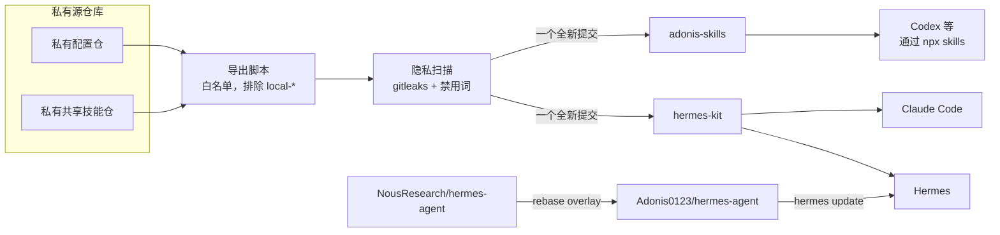

[English](README.md) | 简体中文

# hermes-kit

日常使用 [Hermes Agent](https://github.com/NousResearch/hermes-agent) 的插件、技能和经验笔记，另附一个打过补丁的 Hermes fork 的说明。

<picture>
  <source media="(prefers-color-scheme: dark)" srcset="docs/assets/overview-zh-dark.svg">
  <source media="(prefers-color-scheme: light)" srcset="docs/assets/overview-zh-light.svg">
  
</picture>

## 快速开始

| 我想要 | 执行 |
| --- | --- |
| 安装 Hermes 插件 | `hermes plugins install Adonis0123/hermes-kit/plugins/hermes-lock-screen && hermes plugins enable hermes-lock-screen` |
| 把本仓库登记为 Hermes 技能源（tap），再用 `hermes skills install <name>` 安装 | `hermes skills tap add Adonis0123/hermes-kit` |
| 在 Hermes 里装单个技能 | `hermes skills install Adonis0123/hermes-kit/skills/cursor-cli` |
| 在 Claude Code 里用这些技能 | `/plugin marketplace add Adonis0123/hermes-kit`，再 `/plugin install hermes-kit@hermes-kit` |
| 在 Codex 或其他 agent 里用某个技能 | `npx skills add adonis0123/hermes-kit --skill cursor-cli` |
| 使用打过补丁的 Hermes fork | 见 [docs/hermes-fork.zh-CN.md](docs/hermes-fork.zh-CN.md) |

更多选项（锁定版本、更新、卸载）：[docs/install.zh-CN.md](docs/install.zh-CN.md)。

## 内容

### 插件

| 插件 | 作用 |
| --- | --- |
| [`hermes-lock-screen`](plugins/hermes-lock-screen/) | 仅限主人使用的飞书私聊命令和工具，锁定 macOS 屏幕并确认已锁。设计见 [docs/hermes-lock-screen-design.zh-CN.md](docs/hermes-lock-screen-design.zh-CN.md)。 |

### 技能

技能目录是平铺的：`skills/<name>/SKILL.md`。

| 技能 | 作用 |
| --- | --- |
| [`hermes-upstream-check`](skills/hermes-upstream-check/) | 检查 Hermes Agent 上游仓库有没有新提交和新版本。 |
| [`hermes-daily-review`](skills/hermes-daily-review/) | 修改技能前，先复盘前一天的 Hermes 会话。 |
| [`ai-hotspot-digest`](skills/ai-hotspot-digest/) | 为群聊生成 AI 每日简报（新技能、GitHub 项目、新闻）。 |
| [`feishu-chat-style-review`](skills/feishu-chat-style-review/) | 根据聊天记录，复盘 agent 在飞书群里的回复风格。 |
| [`feishu-ui-feedback`](skills/feishu-ui-feedback/) | 把带 UI 截图的飞书消息转成具体的界面修改。 |
| [`desktop-browser-chrome`](skills/desktop-browser-chrome/) | 在用户真实的 Chrome 里打开链接，不用无头浏览器。 |
| [`cursor-cli`](skills/cursor-cli/) | 从 Hermes 调用 Cursor CLI（`cursor-agent`）：print 模式、流式输出、选模型。 |
| [`writing-with-cursor`](skills/writing-with-cursor/) | 借助 Cursor 起草或润色多段落文字和文档。 |
| [`convert-documents-to-markdown`](skills/convert-documents-to-markdown/) | 把 Word、PowerPoint、Excel、PDF 转成 Markdown。 |

### 文档

| 文档 | 主题 |
| --- | --- |
| [安装](docs/install.zh-CN.md) | 各宿主的安装方式、锁定版本、更新、卸载 |
| [Hermes fork](docs/hermes-fork.zh-CN.md) | fork 是什么、适合谁、怎么切换 |
| [飞书定制](docs/feishu-customizations.zh-CN.md) | fork 的每个补丁对飞书用户有什么变化 |
| [记忆方法](docs/memory-method.zh-CN.md) | `MEMORY.md`、`USER.md`、`SOUL.md` 的写入闸，附[模板](docs/templates/) |
| [ADR](docs/adr/) | 为什么用导出发布本仓库，为什么 fork 用 rebase |
| [术语表](CONTEXT.md) | 文档里用到的术语 |

### 指南

日常运行 Hermes 总结出的方法。

| 指南 | 主题 |
| --- | --- |
| [外部记忆接入门槛](docs/memory-provider-adoption-gate.zh-CN.md) | 热、温、冷三层记忆；什么时候值得接外部 memory provider |
| [飞书网关黑盒验收清单](docs/feishu-gateway-blackbox-checklist.zh-CN.md) | 改配置或升级后手动跑的 6 项检查，以消息 id 为证据 |
| [飞书群安静投递](docs/feishu-quiet-group-delivery.zh-CN.md) | 每个任务在主时间线最多一条，工作放进话题，关掉噪音 |
| [远程锁屏设计](docs/hermes-lock-screen-design.zh-CN.md) | `hermes-lock-screen` 怎样授权、执行并验证 Mac 锁屏 |
| [cron 早报管道模式](docs/cron-digest-pipeline-pattern.zh-CN.md) | 薄管道每日早报：筛选、去重、单通道投递 |
| [经得起升级的定制](docs/upgrade-safe-customization.zh-CN.md) | 哪些能挺过 `hermes update`、定制放哪里、overlay 测试 |

与具体 agent 无关的通用技能，以及推荐的第三方技能清单，放在 [adonis-skills](https://github.com/Adonis0123/adonis-skills)。

## 工作方式

1. 私有仓库是唯一的事实来源，本仓库不手工修改。
2. 导出脚本只复制白名单里的路径。`local-*` 文件存放个人或公司细节，永远不离开私有仓库。
3. 每次导出前跑一次隐私扫描，本仓库 CI 里再跑一次（[`privacy-scan.yml`](.github/workflows/privacy-scan.yml)）。
4. 每次导出落成一个新提交，私有历史不会公开。
5. Hermes fork 是另一条线：上游加一小组 overlay（叠加补丁），每次上游发版后用 rebase 重新叠上。

理由见 [ADR 0001](docs/adr/0001-private-source-allowlist-export.zh-CN.md) 和 [ADR 0002](docs/adr/0002-fork-overlay-via-rebase.zh-CN.md)。

## 给 AI agent

- [`AGENTS.md`](AGENTS.md)：各宿主的安装命令、仓库结构、命名规则、校验命令。
- [`llms.txt`](llms.txt)：给 LLM 的简短索引。
- `skills/` 和 `plugins/` 是生成的。请在这里提 issue 或 PR，改动会落到源仓库。

## 相关项目

- [adonis-skills](https://github.com/Adonis0123/adonis-skills)：通用技能和推荐的第三方技能。
- [Adonis0123/hermes-agent](https://github.com/Adonis0123/hermes-agent)：打过补丁的 Hermes fork。
- [NousResearch/hermes-agent](https://github.com/NousResearch/hermes-agent)：Hermes Agent 上游。

## 许可证

[MIT](LICENSE)
